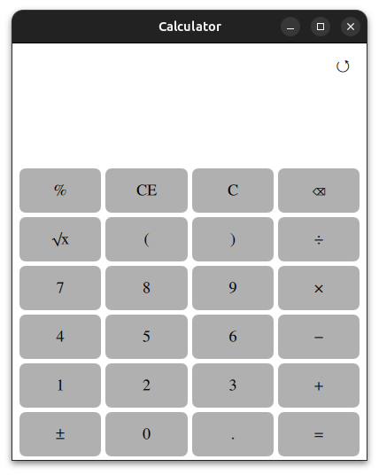
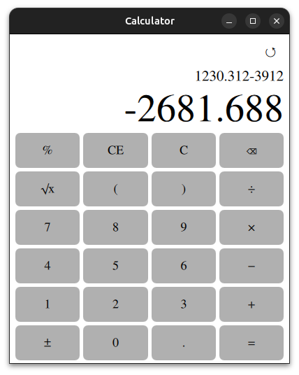
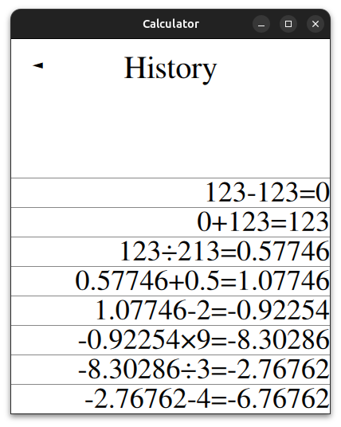

# Calculator

📜 **Description**

This is a standard calculator written in C++ with QML (Qt Quick) UI.  
It supports basic operations: `+`, `-`, `*`, `/`, `^`.  
The parser is implemented using C++17.  
History of calculations is supported.  
The calculator can operate with numbers having up to 100 significant digits (very high precision).             
You can also add and view multiple screenshots within the app.


---

🖼 **UI**

  
  
  

---

📝 **Technologies**

- C++17
- Qt 6  
- QML (Qt Quick)
- Conan
- CMake  
- Boost
- Google Test (gtest) for unit testing
---

💻 **Supported Systems**

- [x] Windows 
- [x] macOS
- [x] Linux 

---

⚙️ **Build and Run**
```bash
git clone https://github.com/Onelig/Calculator.git
cd Calculator/
make install
```
